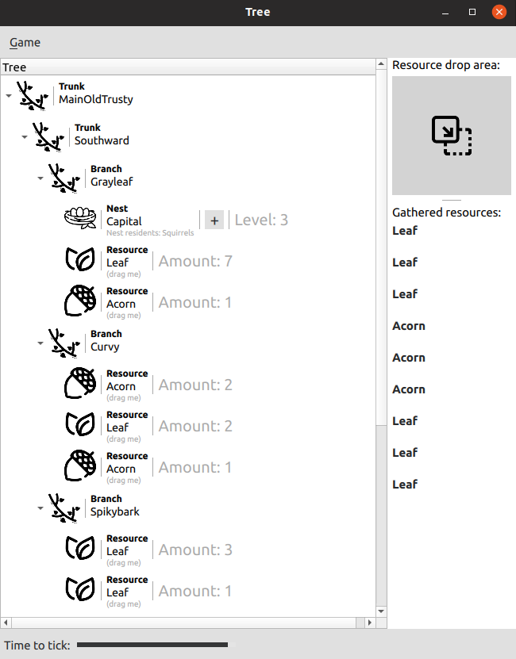
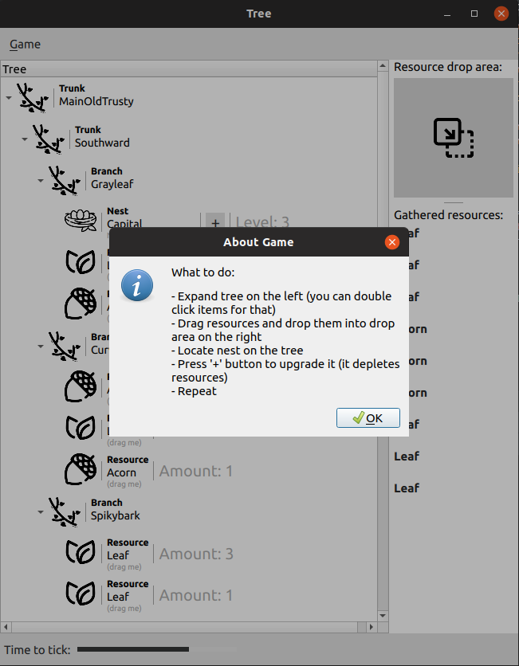

## About

This is small toy example for Qt5/QML practicing. Multiple useful use-cases of TreeView are ill-documented so I decided to make sense of them in practice.

## This example demonstrates following technical capabilities of TreeView

- Custom complex delegates in TreeView
- Using different delegates depending on data role
- Delegates binding to multiple data roles
- Drag and drop outside of TreeView

## What to do in program

- Expand tree on the left (you can double click items for that)
- Drag resources and drop them into drop area on the right
- Locate nest on the tree
- Press '+' button to upgrade it (it depletes resources)
- Repeat

 
 

## Used icons

- Branch/Trunk - https://www.flaticon.com/authors/mehwish
- Nest - https://www.flaticon.com/free-icon/nest_427594
- Acorn - https://www.flaticon.com/free-icon/acorn_1081398
- Leaf - https://www.flaticon.com/authors/royyan-wijaya
- Drop area - https://www.flaticon.com/authors/freepik